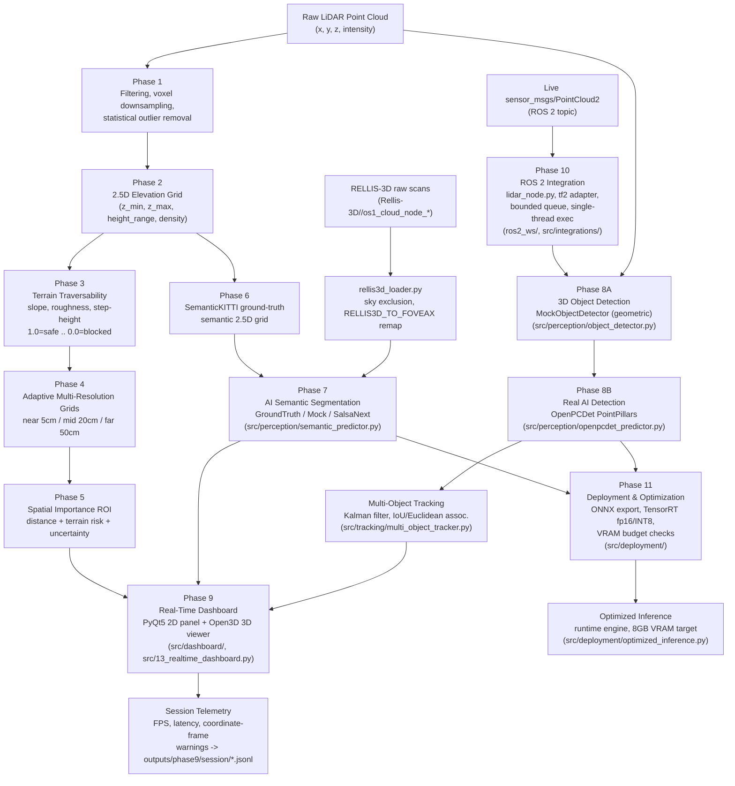

# FoveaX Trail

## Project Description

FoveaX Trail is a deterministic, high-performance LiDAR perception and 2.5D adaptive elevation-grid
mapping pipeline for autonomous navigation and off-road/trail terrain understanding. The design goal
throughout is to keep the real-time path lean — classical geometric processing (voxel grids, slope/
roughness/step-height math, foveated multi-resolution grids) carries as much of the load as possible,
with AI models (SalsaNext for semantic segmentation, PointPillars/OpenPCDet for 3D object detection)
plugged in behind swappable interfaces rather than baked into the core pipeline.

The pipeline runs end to end from a raw LiDAR point cloud to: a 2.5D elevation + traversability map,
a semantic terrain classification, tracked 3D object detections, a live PyQt5/Open3D dashboard, a
ROS 2 integration for live sensor streams, and a deployment/optimization layer (ONNX + TensorRT,
INT8 calibration, VRAM budgeting) targeting memory-constrained GPUs — developed and verified against
an RTX 5050 Laptop GPU (8GB VRAM, Blackwell/sm_120, requires PyTorch cu130+).

Full phase-by-phase description and CLI usage: see `README.md`. This file is oriented at how the
pieces connect, for architecture/codebase questions.

## Pipeline Flow



### Data flow in one line
`Point cloud → filtered/voxelized → 2.5D elevation+traversability grid → semantic classification
(GT/Mock/SalsaNext) → object detection (Mock/PointPillars) → tracking → merged FrameState →
dashboard (PyQt5 + Open3D) / ROS 2 output topics, with TensorRT-optimized inference substituted
in for deployment.`

### Key interfaces (the swap points)
- `SemanticPredictor` (`src/perception/semantic_predictor.py`) — `GroundTruthSemanticPredictor`,
  `MockSemanticPredictor`, `SalsaNextPredictor` all implement this; swap via `--source`.
  `GroundTruthSemanticPredictor` accepts either raw SemanticKITTI-packed `labels_raw` or
  already-remapped `foveax_class_ids` (the latter from `rellis3d_loader.py`) — mutually exclusive
  constructor args.
- `--dataset-type {semantickitti, rellis3d}` on `src/10_ai_semantic_2point5d_map.py` selects which
  dataset root/layout `--sequence`/`--frame` resolve against (SemanticKITTI 2-digit sequences vs.
  RELLIS-3D 5-digit sequences under a different root entirely — see `docs/rellis3d_integration.md`).
- `ObjectDetector` (`src/perception/object_detector.py`) — `MockObjectDetector` (geometric baseline,
  not AI) vs `OpenPCDetPointPillarsDetector` (real AI); swap via `--detector`.
- `SalsaNextPredictor.predict()` is real, working inference (spherical range-image projection ->
  model forward pass -> reverse re-projection -> SemanticKITTI-to-FOVEAX remap), not a stub — see
  `src/perception/range_projection.py`. **Verified accurate on SemanticKITTI (93.3% per-point
  agreement with ground truth) but currently unusable on RELLIS-3D** (11.1% agreement, 85.8% of
  points predicted VEHICLE in a scene with zero real vehicles) due to a sensor/intensity domain
  mismatch between the checkpoint's training sensor (Velodyne HDL-64E) and RELLIS-3D's Ouster
  OS1-64 — full diagnosis in `docs/rellis3d_integration.md`.
- `FrameState` / `HardwareMetrics` (`src/dashboard/dashboard_state.py`) — the single struct that
  carries points, grid_maps, tracks, and metrics from `DataStreamerThread` into both the 2D (Qt) and
  3D (Open3D) dashboard panels. Also carries `coordinate_warnings` from
  `assert_coordinate_frame_consistency()`, a non-blocking cross-panel sanity check.
- Traversability convention is canonical from `src/06_terrain_traversability.py` and
  `src/perception/grid_overlay.py`: **1.0 = safe, 0.0 = blocked**, thresholds Safe ≥ 0.70,
  Caution 0.40–0.70, Blocked < 0.40. Any new traversability-consuming code (colormaps, hatching,
  mock data) must match this or it silently inverts safe/unsafe in the UI.

## Repository Map

```
src/
├── 01-05_*.py                    Phase 1-2: point cloud I/O, filtering, 2.5D elevation grid
├── 06_terrain_traversability.py  Phase 3: canonical traversability convention lives here
├── 07_adaptive_2point5d_map.py   Phase 4: foveated multi-resolution grids
├── 08_spatial_importance_roi.py  Phase 5: ROI importance blending
├── 09_semantickitti_semantic_map.py  Phase 6: ground-truth semantic grid
├── 10_ai_semantic_2point5d_map.py    Phase 7: pluggable AI semantic segmentation CLI
├── 11_object_detection_tracking.py   Phase 8A/8B: detection + tracking CLI
├── 12_env_inspector.py           Environment/hardware capability check
├── 13_optimize_and_deploy.py     Phase 11: CLI for profiling / TensorRT engine build
├── 13_realtime_dashboard.py      Phase 9: dashboard entry point (imports torch before PyQt5 —
│                                  see comment in file, DLL load-order constraint on Windows)
├── perception/                   ObjectDetector, SemanticPredictor and their implementations,
│                                  rellis3d_loader.py (RELLIS-3D file I/O + class remap),
│                                  range_projection.py (spherical projection for SalsaNext)
├── tracking/                     MultiObjectTracker, TrackState (Kalman filter tracking)
├── dashboard/                    FrameState/HardwareMetrics, DataStreamerThread (QThread),
│                                  Qt main window, Open3D viewer process
├── deployment/                   vram_budget, model_exporter (ONNX), tensorrt_builder,
│                                  calibration (INT8), optimized_inference, profiler
└── integrations/                 ROS 2 PointCloud2 <-> numpy adapter, tf2 adapter

ros2_ws/src/foveax_ros/foveax_ros/   Phase 10: lidar_node.py (plain rclpy.Node, not
                                      LifecycleNode — see docs/phase10_ros2_integration.md),
                                      diagnostics.py

docs/                              Phase-specific setup/implementation notes
outputs/phaseN/                    Generated artifacts per phase (git-ignored where large)
tests/                             pytest suite; conftest.py enforces torch-before-PyQt5
                                    import order for the whole session (see below)
```

## Environment Notes (read before touching dependencies)

- **Verify the venv path before using it — it has moved more than once.** It was originally at
  `.venv/` inside this project folder while the project lived on OneDrive-synced `Desktop` (that
  caused real, reproducible corruption during large package installs — OneDrive syncing mid-write).
  It was then moved to `C:\dev\foveax_venv`, and then again to `C:\FOVEAX 2.5D\foveax_venv`
  (sibling of this repo, not inside it) after the whole project was relocated off OneDrive. **As of
  2026-09-11 the real venv is at `C:\FOVEAX 2.5D\foveax_venv`** — `C:\dev\foveax_venv` no longer
  exists. Do not trust a hardcoded path from an old session/transcript; run
  `Test-Path <candidate>\Scripts\python.exe` first. Same caution applies to this repo's own root —
  it has also moved multiple times (currently `C:\FOVEAX 2.5D\FOVEAX_2.5D_TRAIL`).
- **PyTorch must be the `cu130` build** (`torch==2.14.0+cu130`), not `cu126`. The RTX 5050 (Blackwell,
  compute capability `sm_120`) has no kernels in `cu126` — `cuda.is_available()` reports `True` but
  any real op fails with `no kernel image is available for execution on the device`. Always verify
  with an actual op (matmul), not just `is_available()`.
- **Import order: torch before PyQt5, in the same process.** PyQt5's bundled Qt DLLs and torch's
  bundled CUDA DLLs conflict on Windows if PyQt5 loads first — crashes as `OSError: WinError 1114`
  loading `c10.dll`, or a harder native `access violation`. `tests/conftest.py` imports torch first
  for the whole pytest session; `src/13_realtime_dashboard.py` does the same at its entry point. Any
  new entry point or test file that touches both PyQt5 and a torch-based predictor needs this too.

## graphify

This project has a graphify knowledge graph at graphify-out/.

Rules:
- Before answering architecture or codebase questions, read graphify-out/GRAPH_REPORT.md for god nodes and community structure
- If graphify-out/wiki/index.md exists, navigate it instead of reading raw files
- After modifying code files in this session, run `graphify update .` to keep the graph current (AST-only, no API cost)
