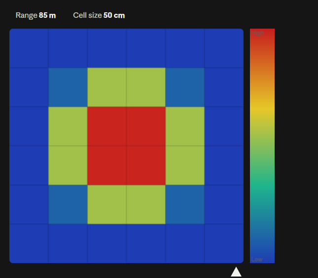
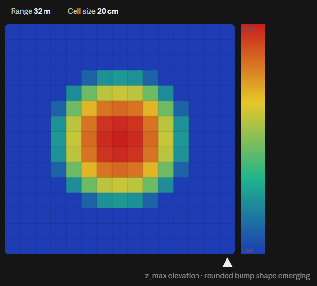
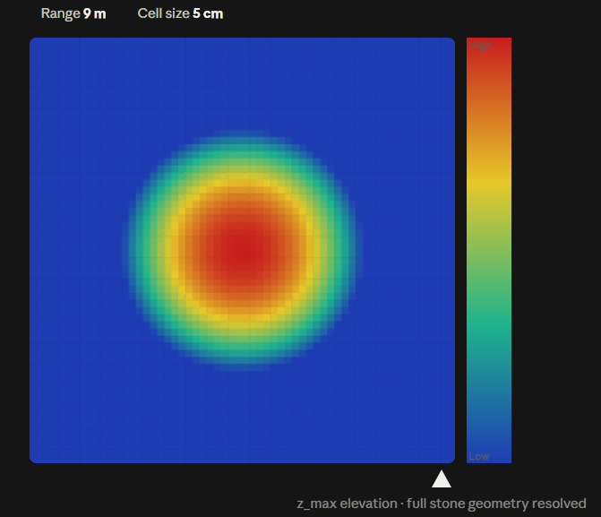
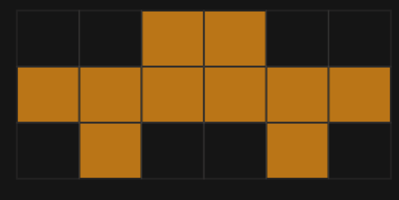
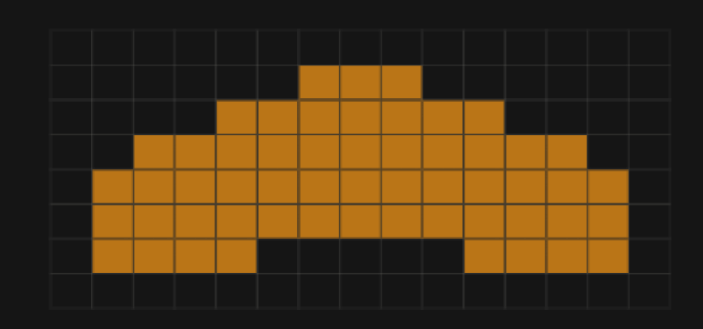
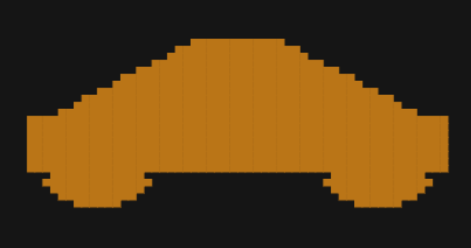

# FOVEAX 2.5D: Adaptive Foveated LiDAR Perception for Off-Road Terrain

FOVEAX is a real-time LiDAR perception pipeline for autonomous ground
vehicles operating on unstructured, off-road terrain. Instead of a
uniform 3D voxel grid (memory-expensive and mostly empty at range) or a
single flat 2D map (loses obstacle/overhang information), FOVEAX builds
a **2.5D elevation grid whose resolution adapts with distance** —
fine (5 cm) near the vehicle where reactive safety decisions matter,
coarse (50 cm) far away where only situational awareness is needed —
then layers real terrain traversability scoring, semantic
classification, and 3D object tracking on top of it, all visualized in
a live PyQt5 + Open3D dashboard.

🖥️ **Run the dashboard**: `python src/13_realtime_dashboard.py` (see [Setup](#4-setup) and [How to Run](#5-how-to-run) below)

<div align="center">
  <video src="https://github.com/Krsna13/FOVEAX-2.5D-PROTOTYPE/raw/main/docs/assets/foveax_dashboard_demo.mp4" controls="controls" width="100%"></video>
  <p><em>🎥 <b>Real-Time FOVEAX Dashboard Demonstration</b> — Live LiDAR streaming, Kalman multi-object tracking, 2.5D adaptive foveated elevation, and terrain traversability in PyQt5 + Open3D</em></p>
  <p><a href="docs/assets/foveax_dashboard_demo.mp4">▶️ <b>Watch / Download Demo Video (MP4)</b></a></p>
</div>

---

## Table of Contents

1. [Architecture](#1-architecture)
2. [Real, Honestly-Reported Results](#2-real-honestly-reported-results)
3. [Adaptive Foveated Resolution — Visual Progression](#3-adaptive-foveated-resolution--visual-progression)
4. [Setup](#4-setup)
5. [How to Run](#5-how-to-run)
6. [Known Limitations](#6-known-limitations)
7. [Project Structure](#7-project-structure)
8. [License](#8-license)

---

## 1. Architecture

Real pipeline flow, with the file that implements each stage:

```
Raw LiDAR point cloud [x, y, z, intensity]
  │
  ├─► Filtering & voxelization ─────────────────  src/03_filter_point_cloud.py
  │
  ├─► 2.5D elevation grid (z_min, z_max,           src/05_create_2point5d_map.py
  │   height_range, point_density)
  │
  ├─► Terrain traversability (slope, roughness,    src/06_terrain_traversability.py
  │   step-height → Safe/Caution/Blocked)
  │
  ├─► Adaptive foveated multi-resolution grid      src/07_adaptive_2point5d_map.py
  │   (Near 5cm / Middle 20cm / Far 50cm)
  │
  ├─► Spatial importance / ROI                     src/08_spatial_importance_roi.py
  │   (distance priority + terrain risk + uncertainty)
  │
  ├─► Semantic segmentation                        src/09_semantickitti_semantic_map.py
  │   (ground truth, mock, or real SalsaNext        src/10_ai_semantic_2point5d_map.py
  │   inference — pluggable)                        src/perception/salsanext_predictor.py
  │
  ├─► 3D object detection & multi-object tracking  src/11_object_detection_tracking.py
  │   (geometric clustering + Kalman filter)         src/tracking/multi_object_tracker.py
  │
  └─► Real-time dashboard                          src/13_realtime_dashboard.py
      (PyQt5 2D/metrics panels + embedded Open3D    src/dashboard/
      3D view, live accuracy, hazard detection)
```

Canonical traversability convention used everywhere in this codebase:
**1.0 = Safe, 0.0 = Blocked** (Safe ≥ 0.70, Caution 0.40–0.70, Blocked
< 0.40 — `src/06_terrain_traversability.py`).

## 2. Real, Honestly-Reported Results

Full detail, methodology, and fresh re-verification of every number
below lives in **[`docs/validation_results.md`](docs/validation_results.md)**
— that document is the source of truth; the numbers here are a summary
of it, not a separate measurement.

| Metric | Result |
|---|---|
| SemanticKITTI semantic accuracy (in-domain, real SalsaNext checkpoint) | **94.98%** overall (96.03% Near / 92.96% Mid / 86.58% Far) |
| RELLIS-3D semantic accuracy (cross-domain, off-road) | **6.65%** baseline → **22.26%** after real sensor-FOV + intensity adaptation — a real, unresolved domain-transfer gap, not a production number |
| Memory reduction vs. uniform 3D voxel grid | **99.98%** cell reduction, **99.71%** byte reduction |
| Real-time dashboard FPS (real RELLIS-3D data, 131,072 pts/frame) | **~13.8 FPS** (steady-state ~15.5–16.6 FPS) — below a 25–30 FPS target; see limitations |
| Test suite | **352 passed**, 0 failures |

The RELLIS-3D accuracy gap is a genuine, documented finding, not a bug:
the pretrained SalsaNext checkpoint was trained on SemanticKITTI's
Velodyne HDL-64E sensor geometry, and RELLIS-3D uses a physically
different sensor (Ouster OS1-64, narrower vertical FOV, different
intensity scale). Adapting the projection FOV and rescaling intensity
more than triples accuracy but doesn't close the gap — closing it fully
would need fine-tuning on RELLIS-3D itself.

## 3. Adaptive Foveated Resolution — Visual Progression

FOVEAX dynamically scales grid resolution across three concentric
zones extending to 100 m (per the PS-26053 specification):

| 🔭 Far Zone (35–100 m, 50 cm cells) | 🧭 Middle Zone (15–35 m, 20 cm cells) | 🎯 Near Zone (0–15 m, 5 cm cells) |
| :---: | :---: | :---: |
|  |  |  |
| Macro-awareness & route guidance | Corridor selection | Full geometric resolution & step hazards |

| 🔭 Far Zone | 🧭 Middle Zone | 🎯 Near Zone |
| :---: | :---: | :---: |
|  |  |  |
| Coarse bounding volume | Cabin/wheel outline emergence | Full structural contours |

Why this works: at long range, LiDAR beam divergence spreads returns
too thin for fine cells to hold any real signal, so a coarse 50 cm grid
aggregates them into usable occupancy while cutting memory by >99.7%
versus a uniform 5 cm 3D voxel grid over the same volume. Near the
vehicle, where reactive collision decisions happen, the full 5 cm
resolution is preserved.

## 4. Setup

### 4.1 Clone and create a virtual environment

```bash
git clone https://github.com/Krsna13/FOVEAX-2.5D-PROTOTYPE.git
cd FOVEAX-2.5D-PROTOTYPE

python -m venv .venv
# Windows:
.venv\Scripts\activate
# Linux/macOS:
source .venv/bin/activate
```

> ⚠️ **Keep the venv, and `external/`/`models/`/`data/`, OUTSIDE any
> cloud-synced folder** (OneDrive, Dropbox, Google Drive, etc.). This
> project's venv previously lived under OneDrive and suffered real,
> confirmed file corruption from the sync client touching files
> mid-write during large package installs and dataset extraction.

### 4.2 Install dependencies

```bash
# Core pipeline only (no GUI, no deep learning):
pip install -r requirements.txt
```

This installs everything needed for the offline grid/traversability
pipeline, the dashboard, and the mock/ground-truth predictors. **It
does not install a working GPU-accelerated PyTorch** — see below.

> ⚠️ **PyTorch / GPU gotcha (read this before running anything with
> `--predictor salsanext`):** the development target is an NVIDIA RTX
> 5050 Laptop GPU (Blackwell, compute capability sm_120). A plain
> `pip install torch` resolves to a cu126 build. That build **installs
> successfully** and even reports `torch.cuda.is_available() == True`
> — but it has no compiled sm_120 kernels, and **silently fails on the
> first real GPU operation** with `CUDA error: no kernel image is
> available for execution on the device`. There is no install-time
> warning. Install the correct build explicitly:
> ```bash
> pip install torch==2.14.0 torchvision --index-url https://download.pytorch.org/whl/cu130
> ```
> If you're on a different GPU generation, use whichever official
> PyTorch CUDA build actually matches your card's compute capability —
> the point is: don't trust a bare `pip install torch` without
> confirming real kernel support for your specific GPU.

### 4.3 Datasets (optional — only needed for real dataset playback)

- **SemanticKITTI**: [semantic-kitti.org/dataset.html](https://semantic-kitti.org/dataset.html)
  — download the Velodyne point clouds + calibration from the linked
  KITTI Vision Benchmark files, and the SemanticKITTI label files from
  the same page. Extract to `data/semantic_kitti/dataset/sequences/`.
- **RELLIS-3D**: [github.com/unmannedlab/RELLIS-3D](https://github.com/unmannedlab/RELLIS-3D)
  — under "Ouster LiDAR → SemanticKITTI Format", download the point
  clouds and annotation labels (Google Drive links on that page; this
  project uses the SemanticKITTI-format `.bin` + label-id layout, not
  the PLY format). Extract to `data/rellis3d/Rellis-3D/<sequence>/`.

  Both dataset pages were verified reachable as of this writing; if a
  Google Drive link has moved, the GitHub README is the stable
  fallback (its maintainers note an access-request email if a link
  goes stale).

### 4.4 SalsaNext checkpoint (optional — only for `--predictor salsanext`)

```bash
git clone https://github.com/TiagoCortinhal/SalsaNext.git external/SalsaNext
```

Then manually download the pretrained checkpoint from the Google Drive
link in the [SalsaNext README](https://github.com/TiagoCortinhal/SalsaNext)
("Pretrained Model" section) — this is a manual step, there is no
direct-download URL. Extract it to
`models/salsanext/pretrained/pretrained/` (containing `SalsaNext`,
`arch_cfg.yaml`, `data_cfg.yaml`). Full details, including two real
bugs found and fixed in the official loading path, are in
[`docs/salsanext_setup.md`](docs/salsanext_setup.md).

## 5. How to Run

Every command below was re-run against the current codebase and
confirmed working before being listed here.

```bash
# --- Offline pipeline stages (each writes real results to outputs/) ---
python src/05_create_2point5d_map.py
python src/06_terrain_traversability.py
python src/07_adaptive_2point5d_map.py
python src/08_spatial_importance_roi.py
python src/09_semantickitti_semantic_map.py       # requires SemanticKITTI

# --- Semantic segmentation (pluggable predictor) ---
python src/10_ai_semantic_2point5d_map.py --source mock
python src/10_ai_semantic_2point5d_map.py --source ground_truth
python src/10_ai_semantic_2point5d_map.py --source salsanext \
    --salsanext-repo external/SalsaNext \
    --checkpoint models/salsanext/pretrained/pretrained/SalsaNext \
    --config models/salsanext/pretrained/pretrained/arch_cfg.yaml \
    --device auto

# Same, on RELLIS-3D with real sensor-domain adaptation:
python src/10_ai_semantic_2point5d_map.py --source salsanext \
    --dataset-type rellis3d --sequence 00000 --frame 000000 \
    --salsanext-repo external/SalsaNext \
    --checkpoint models/salsanext/pretrained/pretrained/SalsaNext \
    --config models/salsanext/pretrained/pretrained/arch_cfg.yaml \
    --device auto

# --- Distance-bucketed accuracy evaluation (Near/Mid/Far + confusion matrix) ---
python src/10b_eval_distance_metrics.py --dataset-type semantickitti --sequence 00 --frame 000000 \
    --salsanext-repo external/SalsaNext \
    --checkpoint models/salsanext/pretrained/pretrained/SalsaNext \
    --config models/salsanext/pretrained/pretrained/arch_cfg.yaml \
    --device auto

python src/10b_eval_distance_metrics.py --dataset-type rellis3d --sequence 00000 --frame 000000 \
    --salsanext-repo external/SalsaNext \
    --checkpoint models/salsanext/pretrained/pretrained/SalsaNext \
    --config models/salsanext/pretrained/pretrained/arch_cfg.yaml \
    --device auto

# --- 3D object detection & tracking ---
python src/11_object_detection_tracking.py --source sample --detector mock --frames 10
python src/11_object_detection_tracking.py --source semantickitti --sequence 00 --start-frame 000000 --frames 5

# --- Real-time dashboard (PyQt5 + embedded Open3D 3D view) ---
python src/13_realtime_dashboard.py                                    # default curated ~2-minute RELLIS-3D demo
python src/13_realtime_dashboard.py --source semantickitti --frames 50
python src/13_realtime_dashboard.py --source rellis3d --sequence 00002 --frames 200

# Headless replay (no GUI, writes telemetry JSONL) — useful for CI/benchmarking:
python src/13_realtime_dashboard.py --source semantickitti --frames 10 --headless
python src/13_realtime_dashboard.py --source rellis3d --frames 10 --headless

# Compare a real model prediction against real ground truth live in the dashboard:
python src/13_realtime_dashboard.py --source semantickitti --predictor salsanext \
    --salsanext-repo external/SalsaNext \
    --checkpoint models/salsanext/pretrained/pretrained/SalsaNext \
    --config models/salsanext/pretrained/pretrained/arch_cfg.yaml

# --- Publication-quality dashboard snapshots (static PNGs) ---
python src/dashboard/export_dashboard_snapshots.py

# --- Phase 11: deployment profiling (RTX 5050 / 8GB VRAM target) ---
python src/13_optimize_and_deploy.py --profile
python src/13_optimize_and_deploy.py --benchmark

# --- Full test suite ---
pytest
```

Dashboard controls (once running): `<< STEP` / `PAUSE`↔`PLAY` /
`STEP >>` to scrub through real frames, `RESTART` to reset to frame 0
with a fresh tracker, an `Hz` field to change playback rate, a left
panel for real Open3D camera controls and 2D map layer selection
(Elevation / Traversability / ROI / Uncertainty / Overhead), and a
right panel with STATUS / TERRAIN / SYSTEM tabs (tracked objects,
hazard table, live accuracy vs. ground truth, hardware telemetry).

## 6. Known Limitations

Pulled directly from [`docs/validation_results.md` §6](docs/validation_results.md#6-known-limitations):

1. **No ego-motion compensation.** This pipeline has no odometry/SLAM.
   Over a long real playback, genuine vehicle motion makes static real
   objects appear to move in the ego-relative frame. Mitigated for
   physically-static classes (vegetation/terrain/structures can never
   be flagged "Dynamic") but not solved for genuinely mobile classes
   (VEHICLE/PEDESTRIAN velocity readings may still be partially
   contaminated by uncompensated ego motion).
2. **RELLIS-3D cross-domain semantic accuracy is low (22.26% overall,
   even after sensor adaptation).** A real, unresolved domain-transfer
   failure, not a production-ready result — see §2 above.
3. **Dashboard FPS (13.8, real) is below typical 25–30 FPS real-time
   targets.** Two rounds of profiling-driven vectorization improved
   this ~3.3x from an original 4.2 FPS; the next real bottleneck
   (identified via profiling, not yet fixed) is
   `scipy.sparse.csgraph.connected_components`'s internal CSR
   conversion overhead (~14 ms/frame).
4. **`MockObjectDetector` is a deterministic geometric baseline, not a
   trained AI detector** — it clusters points above a ground-height
   threshold; it does not perform learned object recognition. Real
   semantic classification only applies when real ground-truth or
   SalsaNext labels are cross-referenced against a cluster.

## 7. Project Structure

```
FOVEAX_2.5D_TRAIL/
├── src/
│   ├── 01_view_open3d_sample.py          Open3D point cloud viewer
│   ├── 02_color_by_height.py             Point cloud colorized by elevation
│   ├── 03_filter_point_cloud.py          Voxel downsampling & outlier removal
│   ├── 04_save_filtered_cloud.py         Point cloud export/verification
│   ├── 05_create_2point5d_map.py         2.5D elevation grid generation
│   ├── 06_terrain_traversability.py      Slope/roughness/step-height scoring
│   ├── 07_adaptive_2point5d_map.py       Multi-zone adaptive grid resolution
│   ├── 08_spatial_importance_roi.py      Spatial ROI + Phase 5 uncertainty
│   ├── 09_semantickitti_semantic_map.py  SemanticKITTI ground-truth semantic grid
│   ├── 10_ai_semantic_2point5d_map.py    Pluggable semantic predictor CLI
│   ├── 10b_eval_distance_metrics.py      Near/Mid/Far accuracy + confusion matrix
│   ├── 11_object_detection_tracking.py   3D detection & multi-object tracking CLI
│   ├── 12_env_inspector.py               Environment/GPU/CUDA diagnostic report
│   ├── 13_optimize_and_deploy.py         Phase 11 ONNX/TensorRT profiling & export
│   ├── 13_realtime_dashboard.py          Real-time PyQt5 + Open3D dashboard entry point
│   │
│   ├── perception/                       Detection, semantic & terrain perception modules
│   │   ├── object_detector.py            MockObjectDetector (geometric clustering)
│   │   ├── openpcdet_predictor.py        OpenPCDet PointPillars wrapper
│   │   ├── salsanext_predictor.py        Real SalsaNext inference adapter
│   │   ├── semantic_predictor.py         Ground-truth/mock semantic predictors
│   │   ├── semantic_labels.py            FOVEAX class taxonomy + label remapping
│   │   ├── rellis3d_loader.py            RELLIS-3D point/label loader
│   │   ├── range_projection.py           Spherical range-image projection (SalsaNext)
│   │   ├── overhead_detection.py         Overhead-clearance vs. solid-obstacle classification
│   │   ├── centerline_profile.py         Forward-corridor elevation cross-section
│   │   ├── ego_motion_estimate.py        Informational real ICP ego-displacement estimate
│   │   └── grid_overlay.py               Traversability colormap/overlay rendering
│   │
│   ├── tracking/
│   │   └── multi_object_tracker.py       Kalman filter + Hungarian assignment tracker
│   │
│   ├── dashboard/                        Real-time dashboard implementation
│   │   ├── qt_main_window.py             PyQt5 main window, all panels/widgets
│   │   ├── data_streamer.py              Real frame processing pipeline (QThread-compatible)
│   │   ├── dashboard_state.py            FrameState/HardwareMetrics dataclasses
│   │   ├── open3d_viewer.py              Embedded Open3D 3D view (separate process)
│   │   ├── win32_embed.py                Windows window-reparenting helpers
│   │   ├── export_web_dashboard_data.py  Real-data JSON export bridge (web dashboard)
│   │   └── export_dashboard_snapshots.py Static publication-quality PNG snapshots
│   │
│   ├── deployment/                       Phase 11: ONNX export, TensorRT, VRAM budgeting
│   └── integrations/                     Phase 10: ROS 2 PointCloud2/TF adapters (requires ROS 2)
│
├── tests/                                352 tests, pytest
├── docs/                                 Setup guides, validation results, phase docs
├── outputs/                              Generated results (grids, plots, dashboard exports)
├── requirements.txt / pyproject.toml     Pinned real dependencies (see comments for GPU note)
└── LICENSE                               MIT
```

Note on `data/`, `models/`, `external/`: all three are gitignored (see
[§4.1](#41-clone-and-create-a-virtual-environment)) since they hold
large datasets/checkpoints/cloned repos that shouldn't live in version
control — you populate them yourself per [Setup](#4-setup).

## 8. License

MIT — see [`LICENSE`](LICENSE).
